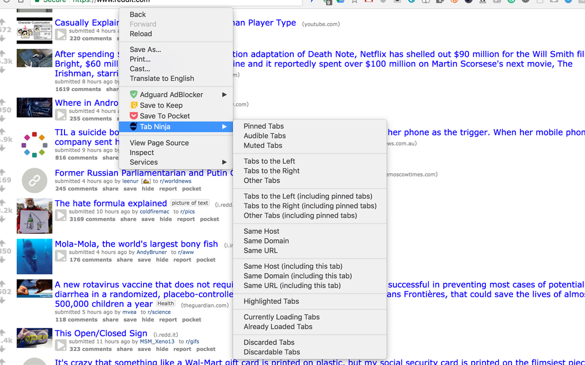

# 🗡 Tab Ninja  

Close tabs with loads of options (left, right, audible, muted, domain, url, pinned, etc)

## Screenshot

## Permissions

* `tabs` / `Read your browsing history`: Used for querying tabs with same url/host/domain

## Development

1. Clone this repo
2. Go to cloned repo directory and do `npm install`
3. Build and start development tasks `npm run dev`
4. Go to chrome extensions [chrome://extensions](chrome://extensions)
5. Enable developer mode
6. Click on load unpacked extension and select this cloned repo

## License

MIT
